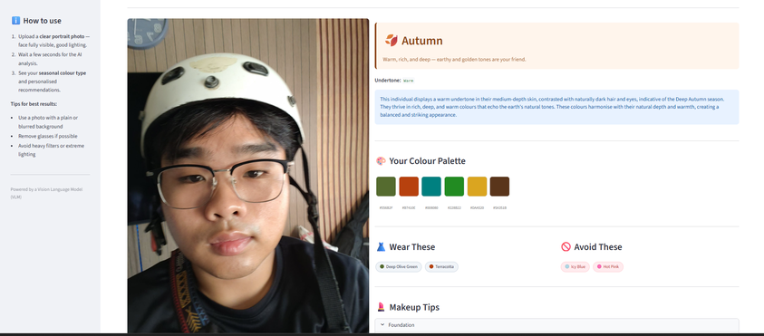

# Agarthan Skin Tone Analyzer (ASTA)

A Streamlit web app that takes a portrait photo, detects the face with OpenCV, and sends it to a Vision Language Model (VLM) to determine the user's **seasonal colour type** — Spring, Summer, Autumn, or Winter — along with a personalised colour palette, outfit suggestions, and makeup tips.

## How it works



```
Upload photo → Face detection & crop (OpenCV) → VLM analysis (Gemini) → Results
```

1. **Face detection** (`face_utils.py`) — OpenCV's Haar cascade locates the face, adds 25% padding, and resizes the crop to 512×512 px
2. **VLM analysis** (`analyzer.py`) — The cropped face is Base64-encoded and sent to Gemini with a prompt that reasons about skin undertone, depth, and colour harmony
3. **UI** (`app.py`) — Streamlit renders the season banner, hex colour swatches, outfit/avoid chips, and makeup tip cards

## Output

| Field | Description |
|---|---|
| `season` | Spring / Summer / Autumn / Winter |
| `undertone` | warm / cool / neutral |
| `palette` | 6 flattering hex colours |
| `outfit_colors` | 4 recommended clothing tones |
| `avoid_colors` | 2 colours to avoid |
| `makeup_tips` | Foundation, blush, lips, eyes guidance |
| `summary` | 2–3 sentence explanation |

## Tech stack

| Layer | Technology |
|---|---|
| UI | Streamlit |
| Face detection | OpenCV Haar cascade |
| Image processing | OpenCV, Pillow |
| VLM | Google Gemini `gemini-2.5-flash` |

## Setup

### 1. Clone and install dependencies

```bash
git clone <repo-url>
cd Skin-Color-Analysis
deactivate
py -m venv .venv
source .venv/bin/activate
pip install -r requirements.txt
```

### 2. Set up the Gemini API key

1. Get an API key from [ai.google.dev](https://ai.google.dev)
2. Create a `.env` file in the project root:
   ```
   GEMINI_API_KEY=your_key_here
   ```

### 3. Run the app

```bash
streamlit run app.py
```

Open [http://localhost:8501](http://localhost:8501) in your browser.

## Usage tips

- Use a clear, well-lit portrait with your face fully visible
- A plain or blurred background gives more accurate results
- Remove glasses if possible; avoid heavy filters or extreme lighting
- Accepts JPG, JPEG, and PNG files

## File structure

```
Skin-Color-Analysis/
├── app.py              # Streamlit UI
├── analyzer.py         # VLM API call, prompt, and JSON parsing
├── face_utils.py       # OpenCV face crop and Base64 encoding
├── requirements.txt    # Python dependencies
├── .env                # API key (never commit this)
├── .gitignore
└── samples/            # Test portrait images
```

## Notes

- Results are AI-generated and intended as inspiration, not professional colour analysis
- The Gemini free tier is rate-limited — avoid rapid sequential requests during testing
